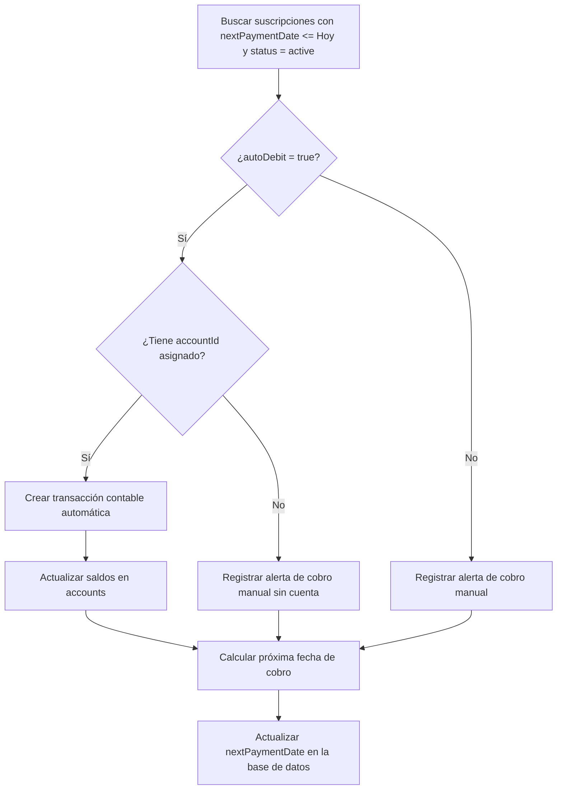

# RFC 004: Gestión de Suscripciones y Débitos Automáticos

*   **ID de la Propuesta:** 004
*   **Título:** Módulo de Suscripciones Recurrentes, Débitos Automáticos e Integración con el Libro Mayor
*   **Estado:** `APPROVED` (Aprobado - 2026-06-23)
*   **Fecha de Creación:** 2026-06-22
*   **Autor:** Antigravity (AI Coding Assistant)

---

## 1. Contexto y Objetivos

Las suscripciones y pagos recurrentes representan un volumen constante de transacciones. Para que la información del balance general de un usuario (o empresa) sea fidedigna, el sistema debe registrar estos egresos en cuanto ocurren de forma programada.

### Objetivos:
1.  **Flexibilidad de Ciclos:** Soportar frecuencias de cobro semanales, mensuales, trimestrales, anuales o personalizadas.
2.  **Débitos Automáticos:** Vincular suscripciones a cuentas contables (`accounts`) específicas para restar el saldo automáticamente en la fecha de corte.
3.  **Automatización sin Pérdida de Control:** Registrar la transacción contable en segundo plano, pero marcarla como `"pendiente de revisión"` para que el usuario confirme si el monto fue el correcto (útil para suscripciones con montos variables o impuestos adicionales).
4.  **Proyecciones de Flujo de Caja:** Utilizar los datos de suscripciones activas para proyectar los gastos fijos del usuario para los siguientes meses.

---

## 2. Esquema de Base de Datos (Drizzle ORM)

Para mantener la coherencia financiera, almacenaremos los montos en **enteros en centavos** (igual que en las transacciones generales) en lugar de utilizar tipos decimales flotantes.

```typescript
import { pgTable, text, integer, boolean, timestamp, uuid } from "drizzle-orm/pg-core";
import { organizations } from "../../features/auth/schema.db";
import { accounts } from "../../features/accounts/schema.db";

export const subscriptions = pgTable("subscriptions", {
  id: uuid("id").primaryKey().defaultRandom(),
  organizationId: uuid("organization_id").references(() => organizations.id, { onDelete: "cascade" }).notNull(),
  name: text("name").notNull(), // Ej: "Netflix", "AWS", "Gimnasio"
  description: text("description"),
  
  // Monto exacto en centavos (ej: $15.99 = 1599)
  amount: integer("amount").notNull(),
  currency: text("currency").default("USD").notNull(),
  
  // Frecuencia del ciclo de cobro
  frequency: text("frequency").notNull(), // 'weekly' | 'monthly' | 'quarterly' | 'yearly' | 'custom'
  intervalCount: integer("interval_count").default(1).notNull(), // Ej: every 2 months (frequency='monthly', intervalCount=2)
  
  // Fechas clave
  startDate: timestamp("start_date").notNull(),
  nextPaymentDate: timestamp("next_payment_date").notNull(),
  
  // Configuración del débito
  autoDebit: boolean("auto_debit").default(false).notNull(),
  accountId: uuid("account_id").references(() => accounts.id, { onDelete: "set null" }), // Cuenta de donde se debita
  
  // Estado de la suscripción
  status: text("status").default("active").notNull(), // 'active' | 'paused' | 'cancelled'
  
  createdAt: timestamp("created_at").defaultNow().notNull(),
  updatedAt: timestamp("updated_at").defaultNow().notNull()
});
```

---

## 3. Lógica del Motor de Automatización (Background Worker)

Un proceso en segundo plano (Cron Job diario o Worker) se ejecutará cada noche para procesar las suscripciones cuya fecha de cobro haya vencido.

### Algoritmo de Procesamiento:


### Cálculo de la Próxima Fecha:
La fecha `nextPaymentDate` se calcula sumando la frecuencia multiplicada por el `intervalCount` a la fecha de cobro actual:
*   `weekly`: $+ (7 \times \text{intervalCount})$ días.
*   `monthly`: $+ (\text{intervalCount})$ meses.
*   `yearly`: $+ (\text{intervalCount})$ años.

---

## 4. Asiento Contable Automatizado (Libro Mayor)

Cuando `autoDebit` es `true` y se dispara el proceso, el sistema inserta una transacción contable atómica en el Libro Mayor (Partida Doble):

*   **Debe (Debit):** Cuenta de *Gasto de Suscripciones / Servicios* por el monto.
*   **Haber (Credit):** Cuenta bancaria asignada (`accountId`, ej: Tarjeta Visa) por el monto.

La transacción se crea con una etiqueta especial `needs_review: true`. Esto permite que el usuario vea un aviso en su panel: *"Registramos tu débito de Netflix ($15.99) en tu Tarjeta Visa. Haz clic aquí si deseas ajustar el monto final (por impuestos locales)"*.

---

## 5. Experiencia de Usuario (UX)

### A. Para Suscripciones con Débito Automático (`autoDebit = true`):
Al ocurrir el cobro, el usuario recibe una notificación push o in-app informativa:
> 💳 **Débito Registrado:** Se ha debitado automáticamente tu suscripción a **AWS ($45.20)** de tu **Tarjeta de Crédito Corporativa**.
> `[ Ver Transacción ]` `[ Corregir Monto ]`

### B. Para Suscripciones Manuales (`autoDebit = false`):
En el día de vencimiento, el usuario recibe un recordatorio interactivo para autorizar el registro:
> ⏰ **Vencimiento de Pago:** Hoy vence tu suscripción a **Gimnasio ($30.00)**. ¿Ya realizaste el pago?
> `[ Registrar Pago Ahora ]` `[ Recordar Mañana ]` `[ Omitir este mes ]`
> 
> *Si selecciona "Registrar Pago", el sistema le pregunta de qué cuenta bancaria salió el dinero y genera el asiento contable al instante.*

---

## 6. Enmienda (2026-09-10) — las secciones 3 y 4 quedan revocadas

Aprobada junto con el [RFC 023](023-proposed-transactions.md), que las reemplaza.

*   **§4 — `needs_review: true` en el libro mayor. Revocada.** Lo propuesto **no entra al libro
    mayor**: el libro guarda hechos ocurridos y una propuesta es una hipótesis. El fundamento es la
    invariante que declara el propio esquema en las columnas de reversión de `ledger_transactions`
    (*«el libro diario es inmutable»*). Un cargo de suscripción se registra **al confirmarlo**, y
    hasta entonces vive fuera, como pendiente derivado.
*   **§3 — el worker nocturno. Revocada en su forma.** No hay proceso en segundo plano: los
    pendientes se derivan al leer, de un puntero por suscripción. Cuando existan los crons de la
    Fase 3 podrán **avisar** que hay pendientes, pero no resolverlos solos — resolver es afirmar que
    algo ocurrió, y eso lo hace una persona.

El resto del RFC 004 sigue vigente, incluida la adenda de julio.

---

## 7. Adenda de Implementación (2026-07-09)

Primera entrega implementada incorporando el dashboard visual de treemap (portado desde el proyecto `finanzasMock` y adaptado a las convenciones de este repositorio). Decisiones registradas:

*   **Campos visuales adicionales** en la tabla `subscriptions` (no contemplados en la propuesta original): `logo_key` (logo de marca o ícono del sistema), `color` (hexadecimal de la tarjeta) y `category` (`design | productivity | entertainment | fitness | security | storage | other`). Alimentan exclusivamente la capa de presentación del dashboard.
*   **`currency` default `"ARS"`** en lugar de `"USD"`, por coherencia con la tabla `accounts` y el resto del dominio contable de este proyecto.
*   **Alcance implementado:** esquema (migración `0011`), repositorio multi-tenant, Server Actions con autenticación, dashboard de treemap, modal de alta/edición con búsqueda de marcas (Brandfetch) y totales mensual/anual.
*   **Pendiente de la propuesta (sin implementar):** motor de automatización en segundo plano (sección 3), asiento contable automatizado en el Libro Mayor (sección 4), notificaciones de vencimiento (sección 5) y gestión de estados `paused`/`cancelled` desde la UI. La columna `next_payment_date` se calcula al crear/editar pero aún no dispara procesos.
