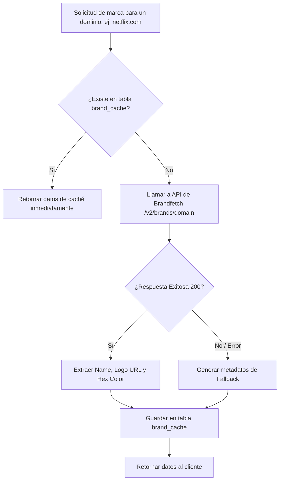

# RFC 005: Integración con la API de Brandfetch y Caché de Logos

*   **ID de la Propuesta:** 005
*   **Título:** Integración del Servicio de Brandfetch en Shared con Caché en Base de Datos
*   **Estado:** `APPROVED` (Aprobado - 2026-06-23)
*   **Fecha de Creación:** 2026-06-22
*   **Autor:** Antigravity (AI Coding Assistant)

---

## 1. Contexto y Objetivos

Para ofrecer una experiencia de usuario premium en nuestro SaaS financiero, las cuentas, transacciones y suscripciones deben mostrar los logotipos y colores corporativos oficiales de las empresas (ej. el isotipo rojo de Netflix, el verde de Spotify o el círculo de Starbucks). 

La API de [Brandfetch](https://brandfetch.com/) es la herramienta líder para este propósito. Proporciona metadatos de marcas mediante consultas por dominio (`/v2/brands/{domain}`).

### Objetivos:
1.  **Centralización en Shared:** Implementar el servicio en `src/shared/services/brandfetchService.ts` para que pueda consumirse desde el módulo de transacciones, suscripciones, tarjetas o perfil.
2.  **Caché Local de Rendimiento:** Evitar consultas repetitivas a la API externa guardando los logotipos y colores en una tabla local `brand_cache` para reducir la latencia a milisegundos y evitar cobros por exceso de peticiones.
3.  **Seguridad y Resiliencia:** Si la API externa no está disponible, falla la autenticación o el dominio no es válido, el sistema debe autogenerar un logo por defecto (usando iniciales de la marca y un color de fondo armonioso) sin interrumpir el funcionamiento de la aplicación.

---

## 2. Esquema de Base de Datos para Caché (Drizzle ORM)

Proponemos añadir una tabla de caché específica para almacenar los resultados optimizados de Brandfetch. De este modo, la aplicación no consulta la API externa en tiempo de renderizado de la UI, sino que consulta nuestra base de datos.

```typescript
import { pgTable, text, timestamp, uuid } from "drizzle-orm/pg-core";

export const brandCache = pgTable("brand_cache", {
  id: uuid("id").primaryKey().defaultRandom(),
  domain: text("domain").notNull().unique(), // Ej: "netflix.com" (Indexado y único)
  name: text("name").notNull(), // Ej: "Netflix"
  logoUrl: text("logo_url"), // URL del PNG/SVG alojado o del CDN
  brandColor: text("brand_color").default("#666666").notNull(), // Color hexadecimal principal (ej: #E50914)
  
  createdAt: timestamp("created_at").defaultNow().notNull(),
  updatedAt: timestamp("updated_at").defaultNow().notNull()
});
```

---

## 3. Lógica del Servicio (`brandfetchService.ts`)

El servicio implementará el patrón **Cache-Aside**.

### Flujo de Consulta de Marca:


### Código Conceptual del Servicio:
```typescript
import { db } from "../db";
import { brandCache } from "../db/schema";
import { eq } from "drizzle-orm";

interface BrandData {
  name: string;
  logoUrl: string | null;
  brandColor: string;
}

export class BrandfetchService {
  private static BRANDFETCH_API_URL = "https://api.brandfetch.io/v2/brands/";
  private static API_KEY = process.env.BRANDFETCH_API_KEY;

  /**
   * Obtiene la información visual de una marca dado su dominio.
   */
  static async getBrand(domain: string): Promise<BrandData> {
    const cleanDomain = domain.toLowerCase().trim();

    try {
      // 1. Intentar obtener desde la caché de la base de datos
      const cached = await db.select().from(brandCache).where(eq(brandCache.domain, cleanDomain)).limit(1);
      if (cached.length > 0) {
        return {
          name: cached[0].name,
          logoUrl: cached[0].logoUrl,
          brandColor: cached[0].brandColor,
        };
      }

      // 2. Si no está en caché, consultar Brandfetch
      if (!this.API_KEY) {
        throw new Error("Brandfetch API Key no configurada");
      }

      const response = await fetch(`${this.BRANDFETCH_API_URL}${cleanDomain}`, {
        headers: {
          Authorization: `Bearer ${this.API_KEY}`,
        },
      });

      if (!response.ok) {
        throw new Error(`Error en Brandfetch: ${response.statusText}`);
      }

      const data = await response.json();
      
      // Extraer datos relevantes
      const name = data.name || cleanDomain.split(".")[0];
      const logoUrl = data.logos?.[0]?.formats?.[0]?.src || null;
      const brandColor = data.colors?.[0]?.hex || "#666666";

      const brandResult = { name, logoUrl, brandColor };

      // 3. Almacenar en la base de datos para futuras consultas
      await db.insert(brandCache).values({
        domain: cleanDomain,
        name,
        logoUrl,
        brandColor,
      });

      return brandResult;

    } catch (error) {
      console.warn(`Brandfetch falló para ${domain}, usando fallback.`, error);
      
      // 4. Fallback resiliente: Iniciales del dominio y color gris neutro
      const fallbackResult = {
        name: cleanDomain.split(".")[0].toUpperCase(),
        logoUrl: null,
        brandColor: "#71717A",
      };

      // Guardamos el fallback en caché para no reintentar fallidos infinitamente
      await db.insert(brandCache).values({
        domain: cleanDomain,
        name: fallbackResult.name,
        logoUrl: null,
        brandColor: fallbackResult.brandColor,
      }).onConflictDoNothing();

      return fallbackResult;
    }
  }
}
```
