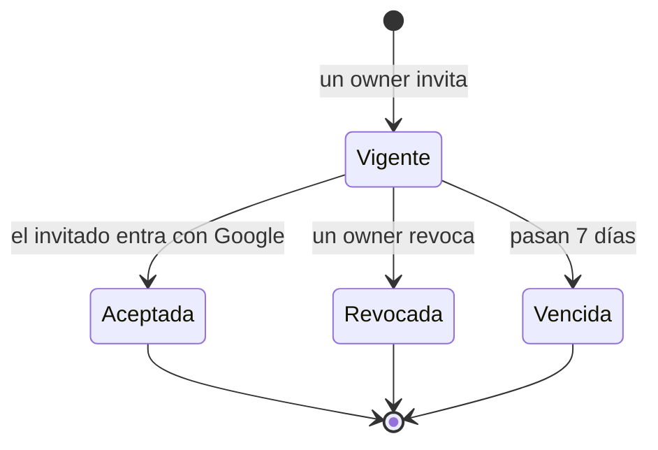

# Spec — Acceso con Google a organizaciones compartidas

**Estado:** `aprobada` (2026-10-06) — el usuario aprobó supuestos y texto, ambos sin leer.
**Fecha:** 2026-10-06 · **Revisión 2026-10-06:** se suma el rol de sólo lectura (ronda 3, para el contador)
**Traza:** [`assumptions.md`](assumptions.md) · **Hermano técnico:** ninguno todavía (el plan viene después).

---

## Historia

Como **persona que lleva sus finanzas en FinanzIA**, quiero **entrar con mi cuenta de Google y compartir una
organización con otras personas, pudiendo pertenecer a varias**, para **usar la aplicación de a dos —mi
pareja y yo sobre la casa— sin compartir una contraseña, y tener aparte la plata de un negocio o un trabajo**.

## Contexto y problema

Hoy el acceso es sólo email y contraseña, y la estructura lo hace imposible de compartir:

- `users.organizationId` es `notNull` y 1 a 1 (`src/features/auth/schema.db.ts:22`): una persona, una organización.
- `users.role` es un solo valor por usuario (`:23`) y nada lo consume.
- `passwordHash` y `salt` son obligatorios (`:25-26`): no cabe un usuario que sólo tiene Google.
- No existe registro, invitación ni alta de usuarios. En la base hay un único usuario, `admin@ejemplo.com`.
- El JWT lleva un solo `organizationId` (`src/shared/lib/auth.ts`, callback `jwt`) y todo el aislamiento
  multi-tenant cuelga de él.
- **Ningún camino de producción crea una organización:** sólo el seed y los tests insertan en `organizations`.

Se desbloquea: dos personas en la misma organización, una persona con varias, y la puerta de entrada que
necesitan las pantallas que siguen (despliegue, estadísticas, la API del RFC 012).

## Alcance

**Incluye**
- Login con Google junto al login por contraseña, que se conserva.
- Modelo de pertenencia: una persona en N organizaciones, con rol por organización: `owner`, `member` y `viewer` (sólo lectura, pensado para un contador).
- Invitaciones por organización y gestión de miembros (invitar, revocar, quitar).
- Organización activa en la sesión, con selector para cambiarla.
- Alta de organizaciones nuevas por usuarios ya autorizados, con su plan de cuentas inicial.
- Migración del usuario existente y retiro de `admin@ejemplo.com`.

**No incluye**
- El despliegue a un host con HTTPS (plan aparte, **previo** a que otra persona entre).
- Autoría por movimiento («quién cargó esto»), cuentas o categorías privadas por persona.
- Eliminar, transferir, renombrar organizaciones o cambiar el rol de un miembro desde la interfaz.
- Vista consolidada entre organizaciones.
- Recuperación de contraseña, edición de perfil (`/profile`) y la pestaña Seguridad.
- Otros proveedores de identidad.

## Glosario

| Término | Significa |
| :--- | :--- |
| **Organización** | La unidad de datos: casa, pareja, familia, negocio, trabajo. Todo lo contable pertenece a una |
| **Membresía** | El vínculo persona↔organización, con su rol |
| **Organización activa** | La que la sesión está usando ahora; todo lo que se lee o escribe es de ella |
| **Invitación** | Autorización previa, por email y organización, para entrar con Google |
| **Rol** | `owner` (administra miembros), `member` (opera lo contable) o `viewer` (sólo mira) |
| **`sub`** | Identificador estable que Google da a una cuenta, distinto del email |

## Actores

| Acción | `owner` | `member` | `viewer` | Con Google, sin invitación ni usuario |
| :--- | :---: | :---: | :---: | :---: |
| Entrar con Google | ✓ | ✓ | ✓ | ✗ |
| Ver todo lo contable y todas las pantallas | ✓ | ✓ | ✓ | — |
| Modificar lo contable de la organización activa | ✓ | ✓ | ✗ | — |
| Ver la lista de miembros e invitaciones | ✓ | ✗ | ✗ | — |
| Invitar, revocar invitaciones, quitar miembros | ✓ | ✗ | ✗ | — |
| Cambiar de organización activa | ✓ | ✓ | ✓ | — |
| Crear una organización nueva (queda `owner`) | ✓ | ✓ | ✓ | ✗ |
| Editar su propio perfil | ✓ | ✓ | ✓ | — |

## Reglas de negocio

**Identidad**
- **RN-1.** Sólo se acepta un email que Google marque como verificado.
- **RN-2.** La identidad de Google se resuelve en este orden, y gana el primero que aplique:
  1. el `sub` ya está vinculado a un usuario → es ese usuario;
  2. el email normalizado coincide con un usuario existente que no tiene `sub` → se le vincula el `sub`;
  3. existe al menos una invitación vigente para ese email → se crea el usuario;
  4. ninguna de las anteriores → se rechaza.
- **RN-3.** El email se compara normalizado (minúsculas, sin espacios). Una vez vinculado el `sub`, un cambio de email en Google no rompe el acceso.
- **RN-4.** En cada login Google se aceptan **todas** las invitaciones vigentes de ese email: cada una crea una membresía. Las vencidas o revocadas se ignoran.
- **RN-5.** Un usuario sin ninguna membresía no entra, aunque su identidad sea válida.
- **RN-6.** Un usuario creado con Google no tiene contraseña y no puede entrar por el formulario de email; ese intento responde igual que una contraseña incorrecta y consume el mismo tiempo (el señuelo de `auth.ts` ya lo hace con hash inexistente).
- **RN-7.** El bloqueo por intentos fallidos (`loginAttempts`) no se aplica al flujo de Google y se mantiene tal cual en el de contraseña.
- **RN-8.** Nombre y foto se toman de Google en cada login. Moneda, zona horaria e idioma son del perfil y no se tocan.

**Invitaciones y miembros**
- **RN-9.** Sólo un `owner` invita, revoca y quita, y sólo en la organización activa. Puede invitar con rol `owner`, `member` o `viewer`.
- **RN-10.** Una invitación vence a los 7 días. Hay a lo sumo una vigente por (organización, email), y no se invita a quien ya es miembro.
- **RN-11.** Quitar a un miembro borra su membresía en esa organización. Su usuario, sus otras organizaciones y todos los movimientos que cargó se conservan: los datos son de la organización.
- **RN-12.** No se puede quitar al único `owner` de una organización. Un `viewer` no cuenta como `owner`.

**Organización activa**
- **RN-13.** La sesión lleva una organización activa. Cambiarla exige que el servidor verifique la membresía; el identificador que manda el cliente no se acepta sin esa verificación.
- **RN-14.** Al volver a entrar se abre la última organización usada. Si el login aceptó una invitación nueva y la persona no tenía ninguna organización previa, se abre la invitada.
- **RN-15.** Cada revalidación de la sesión (≤ 5 min en producción, `REVALIDACION_MS`, `auth.ts:42`) comprueba que la membresía de la organización activa siga existiendo y refresca el rol desde ella. Si se perdió y quedan otras membresías, la sesión pasa a la usada más recientemente; si no quedan, se invalida.
- **RN-16.** Ningún dato cruza organizaciones: toda lectura y escritura va con el `organizationId` de la organización activa.

**Organizaciones nuevas**
- **RN-17.** Cualquier usuario con al menos una membresía puede crear una organización: nombre obligatorio de 1 a 100 caracteres. Queda como `owner` y pasa a ser la activa.
- **RN-18.** Una organización nace con el catálogo estándar de categorías, sus cuentas en pesos y la cuenta de Patrimonio Neto inicial (`3.1.01.01`), **en una sola transacción**: si falla el aprovisionamiento, no queda una organización a medias. La hoja `General` no se aprovisiona: nace sobre demanda con el primer movimiento sin categoría (`categoryRepository.findOrCreateTypeGeneralLeaf`).

**Arranque**
- **RN-19.** No hay ningún `owner` que pueda invitar al primero, así que la **primera invitación** (rol `owner`, sobre la organización existente) la crea un procedimiento operativo fuera de la interfaz. `admin@ejemplo.com` se elimina **sólo después** de que esa membresía `owner` exista.
- **RN-20.** El botón de Google aparece sólo si el entorno trae las credenciales; sin ellas, la aplicación funciona con contraseña como hoy.

**Sólo lectura (`viewer`)**
- **RN-21.** Un `viewer` ve **todo** lo contable y todas las pantallas, incluidas las de presupuestos, estadísticas y metas. No ve la pestaña Miembros ni la lista de miembros e invitaciones.
- **RN-22.** Un `viewer` **no modifica nada**: los botones de acción **no se muestran** (no se deshabilitan), incluida la bandeja de recurrencias. Puede crear organizaciones propias y editar su perfil, porque eso no toca la organización ajena.
- **RN-23.** El **servidor** rechaza toda escritura de un `viewer` aunque la interfaz se fuerce, con el mensaje «No tenés permiso para modificar esta organización».
- **RN-24.** El rol que decide una escritura se lee de la **base** en cada escritura, no del token: una sesión cuyo token dice `member` pero cuya membresía ya es `viewer` queda rechazada. Cuesta una consulta por escritura.
- **RN-25.** El relleno automático de resúmenes mensuales al abrir el dashboard sigue permitido para un `viewer`: es dato derivado, no una acción suya.
- **RN-26.** Para pasar a alguien de `viewer` a `member`, o al revés, se lo quita y se lo reinvita; cambiar el rol sigue fuera de alcance.
- **RN-27.** La organización activa muestra «Sólo lectura» junto a su nombre en el selector cuando el rol es `viewer`.

### Tabla de decisión — qué pasa al entrar con Google

El orden de evaluación es el de RN-2. Lo cruzado es lo que expuso el hueco de las dos filas marcadas.

| # | Email verificado | `sub` vinculado | Usuario con ese email sin `sub` | Invitación vigente | Resultado |
| :-: | :-: | :-: | :-: | :-: | :--- |
| 1 | no | — | — | — | Rechazo |
| 2 | sí | sí | — | — | Entra; acepta invitaciones vigentes si hay (RN-4) |
| 3 | sí | no | sí | — | Vincula el `sub` y entra; acepta invitaciones vigentes |
| 4 | sí | no | no | sí | Crea el usuario y las membresías; entra |
| 5 | sí | no | no | no | Rechazo |
| 6 | sí | sí / vinculado | — | — pero **0 membresías** | Rechazo (RN-5) |

Las filas 3 y 6 no estaban en los supuestos: la 3 evita un usuario duplicado para quien ya existía por contraseña; la 6 evita una sesión sin organización.

## Flujos

**Camino feliz — ella se suma a la casa**
1. Vos, `owner` de «Casa», abrís Configuración → Miembros e invitás su Gmail con rol `member`.
2. Ella abre la aplicación, toca «Continuar con Google» y elige su cuenta.
3. El sistema verifica el email, no encuentra usuario pero sí la invitación (RN-2.3), crea su usuario y su membresía y la deja en «Casa».
4. Ella ve las mismas cuentas, tarjetas y movimientos que vos.

**Alternativos**

| # | Situación | Qué pasa |
| :-: | :--- | :--- |
| A1 | Email de Google sin invitación ni usuario | «Tu cuenta no tiene acceso». Sin revelar si existe esa organización |
| A2 | Ella cancela en Google o Google falla | Vuelve al signin con un mensaje genérico traducido |
| A3 | La invitación venció o se revocó | Igual que A1 |
| A4 | Ya existía por contraseña con ese email | Se vincula el `sub`; no se duplica el usuario (fila 3) |
| A5 | Le llega una invitación a otra organización estando ya adentro | Se acepta en su próximo login (ver PA-1) |
| A6 | Lo quitan de la organización que tiene activa | En ≤ 5 min pasa a otra suya, o la sesión se invalida si no tiene más (RN-15) |
| A7 | Un `owner` intenta quitar al único `owner` | Rechazo con mensaje claro; no cambia nada |
| A8 | Crea una organización y el aprovisionamiento falla | No queda organización; ve el error y sigue en la anterior |
| A9 | Intenta entrar con contraseña un usuario de Google | Misma respuesta que contraseña incorrecta |

### Diagrama de estados — invitación



`Vencida` no se escribe como transición: se deriva de la fecha de vencimiento al consultar.

## Wireframes

**Signin — estado base**
```
┌──────────────────────────────────────┐
│             FinanzIA                 │
│                                      │
│   ┌──────────────────────────────┐   │
│   │  G   Continuar con Google    │   │
│   └──────────────────────────────┘   │
│   ───────────── o ─────────────      │
│   Email      [____________________]  │
│   Contraseña [____________________]  │
│   ┌──────────────────────────────┐   │
│   │          Ingresar            │   │
│   └──────────────────────────────┘   │
└──────────────────────────────────────┘
```
*Sin credenciales de Google en el entorno (RN-20):* desaparecen el botón y el separador «o».
*Sin acceso (A1):* sobre el botón, una banda `Tu cuenta no tiene acceso. Pedile a quien administra tu organización que te invite.` El foco queda en el botón.
*Cargando:* el botón se deshabilita y muestra «Conectando…».

**Selector de organización — región del encabezado**
```
┌──────────────────────────┐
│ Casa                   ▾ │
├──────────────────────────┤
│ ✓ Casa                   │
│   Taller                 │
│ ────────────────────────  │
│ + Crear organización     │
└──────────────────────────┘
```
*Con rol `viewer`:* al lado del nombre de la organización aparece «Sólo lectura».
*Con una sola organización:* el selector se muestra igual, porque es la puerta a «Crear organización».

**Configuración → Miembros — sólo `owner`**
```
┌────────────────────────────────────────────────────┐
│ Miembros de Casa                  [ + Invitar ]    │
│ ──────────────────────────────────────────────────  │
│ Juan Cruz R.   jcrod…@gmail.com   owner            │
│ Ana            ana…@gmail.com     member   [Quitar]│
│ ──────────────────────────────────────────────────  │
│ Invitaciones pendientes                            │
│ luis…@gmail.com   member   vence 13/10   [Revocar] │
└────────────────────────────────────────────────────┘
```
*Vacío de pendientes:* se oculta la sección. *Un `member`:* la pestaña no aparece. *Quitar al único `owner`:* el botón está deshabilitado y explica por qué.

## Datos

| Entidad | Campos | Validaciones y notas |
| :--- | :--- | :--- |
| `users` (cambia) | `googleSub` único, nullable · `image` nullable · `lastOrganizationId` nullable · `passwordHash`/`salt` pasan a nullable | Se **retiran** `organizationId` y `role`. Un usuario con `googleSub` nulo debe tener contraseña, y al revés |
| `memberships` (nueva) | `userId` · `organizationId` · `role` (`owner`/`member`/`viewer`) · `createdAt` | Clave única `(userId, organizationId)`. `onDelete: cascade` hacia ambos lados |
| `invitations` (nueva) | `id` · `organizationId` · `email` normalizado · `role` (`owner`/`member`/`viewer`) · `invitedBy` · `status` (`pending`/`accepted`/`revoked`) · `expiresAt` · `createdAt` · `acceptedAt` | Única vigente por `(organizationId, email)`. Se conservan como historial; no se purgan |
| `organizations` | sin cambios | `slug` generado único a partir del nombre |
| `profiles` | sin cambios | Ya es por usuario (`profile/schema.db.ts:12`) |

**Migración.** Antes de retirar `users.organizationId`, cada usuario existente recibe una membresía con su rol actual y, para el primero, `owner`. La migración no es reversible sin ese paso, y el orden importa.

## Criterios de aceptación

```gherkin
AC-1 — Una invitada entra por primera vez
  Dado un owner de «Casa» que invitó a ana@gmail.com como member
    y Ana sin usuario en el sistema
  Cuando Ana entra con Google y su email viene verificado
  Entonces ve «Casa» con las mismas cuentas y movimientos que el owner
    y no ve la pestaña Miembros
```
```gherkin
AC-2 — Sin invitación no se entra
  Dado un email de Google verificado que no es de ningún usuario ni tiene invitación
  Cuando intenta entrar con Google
  Entonces ve «Tu cuenta no tiene acceso» en el signin
    y no se crea ningún usuario
```
```gherkin
AC-3 — Email no verificado
  Dado un email de Google marcado como no verificado, aun con invitación vigente
  Cuando intenta entrar
  Entonces es rechazado y no se crea ningún usuario
```
```gherkin
AC-4 — Invitación vencida o revocada
  Dado una invitación que venció hace un día  (o que un owner revocó)
  Cuando el invitado entra con Google
  Entonces es rechazado como sin acceso
```
```gherkin
AC-5 — Usuario existente por contraseña
  Dado un usuario creado con contraseña cuyo email es luis@gmail.com
  Cuando entra con Google con ese email verificado
  Entonces entra a su usuario existente, sin duplicarlo
    y el siguiente login con Google lo reconoce por su identificador de Google
```
```gherkin
AC-6 — Cambió el email en Google
  Dado un usuario ya vinculado a Google que cambia su email en Google
  Cuando entra
  Entonces entra al mismo usuario, con las mismas organizaciones
```
```gherkin
AC-7 — Varias organizaciones
  Dado un usuario miembro de «Casa» y de «Taller»
  Cuando elige «Taller» en el selector
  Entonces ve sólo las cuentas, tarjetas y movimientos de «Taller»
    y al cerrar sesión y volver a entrar se abre «Taller»
```
```gherkin
AC-8 — El cliente no puede elegir una organización ajena
  Dado un usuario miembro sólo de «Casa»
  Cuando fuerza el identificador de otra organización al cambiar de activa
  Entonces la petición es rechazada y sigue en «Casa»
```
```gherkin
AC-9 — Invitar a alguien que ya tiene usuario
  Dado Ana, ya miembro de «Casa»
  Cuando un owner de «Taller» la invita
  Entonces en su siguiente login con Google ve «Casa» y «Taller» en el selector
    y no se creó un segundo usuario
```
```gherkin
AC-10 — Quitar a un miembro
  Dado Ana, miembro de «Casa» con 12 movimientos cargados por ella
  Cuando un owner la quita
  Entonces Ana pierde el acceso a «Casa» en no más de 5 minutos
    y los 12 movimientos siguen en «Casa»
    y sus otras organizaciones siguen intactas
```
```gherkin
AC-11 — El único owner
  Dado una organización con un solo owner
  Cuando ese owner intenta quitarse
  Entonces se rechaza y la organización conserva su owner
```
```gherkin
AC-12 — Crear una organización
  Dado un usuario autenticado
  Cuando crea «Local» desde el selector
  Entonces «Local» queda activa, él es owner
    y ya tiene el catálogo estándar de categorías y la cuenta de Patrimonio Neto inicial
    y puede registrar un gasto sin elegir categoría
```
```gherkin
AC-13 — Falla el aprovisionamiento
  Dado un error al crear el plan de cuentas
  Cuando un usuario crea una organización
  Entonces no queda ninguna organización «a medias» en la base
    y el usuario sigue en la que tenía
```
```gherkin
AC-14 — Un usuario de Google no entra por contraseña
  Dado un usuario creado sólo con Google
  Cuando intenta entrar con su email en el formulario
  Entonces la respuesta es igual a la de una contraseña incorrecta
```
```gherkin
AC-15 — Aislamiento entre organizaciones
  Dado dos organizaciones con una cuenta cada una
  Cuando un usuario activo en la primera lista cuentas
  Entonces no aparece la cuenta de la segunda
```
```gherkin
AC-16 — Sin credenciales de Google
  Dado un entorno sin las credenciales de Google
  Cuando se abre el signin
  Entonces no hay botón de Google y el login por contraseña funciona igual
```
```gherkin
AC-17 — Arranque
  Dado la base actual con sólo admin@ejemplo.com
  Cuando se ejecuta el procedimiento de arranque con el Gmail del dueño
    y el dueño entra con Google
  Entonces el dueño es owner de la organización existente
    y recién entonces admin@ejemplo.com deja de existir
```

```gherkin
AC-18 — Un contador mira y no toca
  Dado un viewer invitado a «Casa» por un owner
  Cuando entra con Google y recorre cuentas, movimientos, tarjetas y estadísticas
  Entonces ve todo
    y ningún botón de alta, edición, reversa o archivado aparece en ninguna pantalla
```
```gherkin
AC-19 — El servidor lo frena aunque se fuerce
  Dado un viewer de «Casa»
  Cuando invoca directamente una acción de escritura, como crear un movimiento
  Entonces recibe «No tenés permiso para modificar esta organización»
    y no se escribe nada
```
```gherkin
AC-20 — El rol se lee de la base
  Dado una sesión cuyo token dice member y cuya membresía en la base es viewer
  Cuando intenta crear un movimiento
  Entonces es rechazada
```
```gherkin
AC-21 — Un contador con varios clientes
  Dado un usuario viewer en «Casa» y owner en «Estudio»
  Cuando cambia de una a otra en el selector
  Entonces en «Casa» no ve acciones de escritura y ve «Sólo lectura»
    y en «Estudio» ve todas
```
```gherkin
AC-22 — Lo que no ve un viewer
  Dado un viewer
  Cuando abre Configuración
  Entonces no ve la pestaña Miembros
```
```gherkin
AC-23 — El dashboard sigue funcionando
  Dado un viewer
  Cuando abre el dashboard y faltan resúmenes mensuales
  Entonces se rellenan y el dashboard carga normalmente
```

## Requisitos no funcionales

- **NFR-1.** La sesión sigue siendo JWT de 12 h con renovación horaria (`auth.ts:36-37`).
- **NFR-2.** La invitación, el alta de usuario con sus membresías y el alta de organización con su plan de cuentas son atómicos.
- **NFR-3.** Los textos nuevos —botón, errores, selector, pestaña Miembros— existen en `es`, `en` y `br` desde el primer día. Los errores del servidor siguen siendo frases, con la deuda ya registrada (`TECHNICAL_DEBT.md` §3).
- **NFR-4.** Ningún secreto de Google entra al repositorio; vive en el entorno y se valida con el módulo de entorno existente.
- **NFR-5.** La navegación del selector y de la pestaña Miembros es accesible por teclado y respeta el estilo del repo (sin movimiento ni cambio de tamaño en `:hover`).

## Dependencias

1. **Credenciales de Google** (client id y secret) creadas por vos en Google Cloud Console, con la URI de redirección `http://localhost:3000/api/auth/callback/google` en desarrollo.
2. **Despliegue** con dominio HTTPS antes de que otra persona entre: su URI de redirección se agrega a las credenciales. Plan aparte.
3. **Aprovisionamiento extraído del seed**: el catálogo inicial de categorías, sus cuentas y la cuenta de Patrimonio Neto hoy sólo los crea `seed.ts`. Tiene que existir como servicio reutilizable antes de RN-17.
4. **La base limpia**: el plan de resúmenes mensuales (`docs/planes/fix-resumenes-mensuales.md`) deja el seed arreglado y precede a esto.

## Supuestos resueltos

| Supuesto | Decisión | Por qué |
| :--- | :--- | :--- |
| Google junto a contraseña | Conviven | No hay otro camino para el usuario actual hasta que su Google exista |
| Registro abierto | No: sólo por invitación | Es una aplicación financiera; abrir el alta expone una organización a cualquiera con un Gmail |
| Una o varias organizaciones por persona | **Varias** | Corrección del usuario: la organización es la unidad de datos —casa, pareja, negocio, trabajo— y una persona es parte de varias |
| Dónde vive el rol | En la membresía | Con N organizaciones, el rol por usuario no tiene sentido |
| Quién crea organizaciones | Cualquier usuario autorizado | Sin esto, el negocio o el trabajo nunca se podrían abrir |
| Primer `owner` | Procedimiento operativo | No hay `owner` previo que invite |
| Identidad | Por `sub`, con el email sólo para el primer enlace | El email de Google puede cambiar; el `sub` no |
| Despliegue | Fuera de esta spec | Es una cadena de trabajo propia |
| Rol de sólo lectura | `viewer`, enforcement en el servidor leyendo el rol de la base | Un contador tiene que poder mirar sin poder tocar, y el cliente no es una barrera |

## Preguntas abiertas

- **PA-1.** Quien ya tiene una sesión no ve una invitación nueva hasta volver a entrar. ¿Alcanza con eso, o la bandeja de invitaciones debe mostrarse dentro de la sesión? Se asumió que alcanza; no se decidió con el usuario.
- **PA-2.** Si un `owner` invita con rol `owner`, ¿puede esa persona luego quitarlo a él? Se asumió que sí, y RN-12 sólo protege al último `owner`. Sin cambio de rol (fuera de alcance), no hay forma de degradarlo después.
- **PA-3.** Límite de organizaciones por usuario o de miembros por organización: no se fijó ninguno.

## Secciones condicionales descartadas

- **Contrato de interfaz:** no hay API pública; la parte expuesta es el callback de NextAuth, que no se escribe a mano.
- **Mediciones pendientes:** no quedó ningún `M-n`; lo verificable se verificó leyendo el repo.
