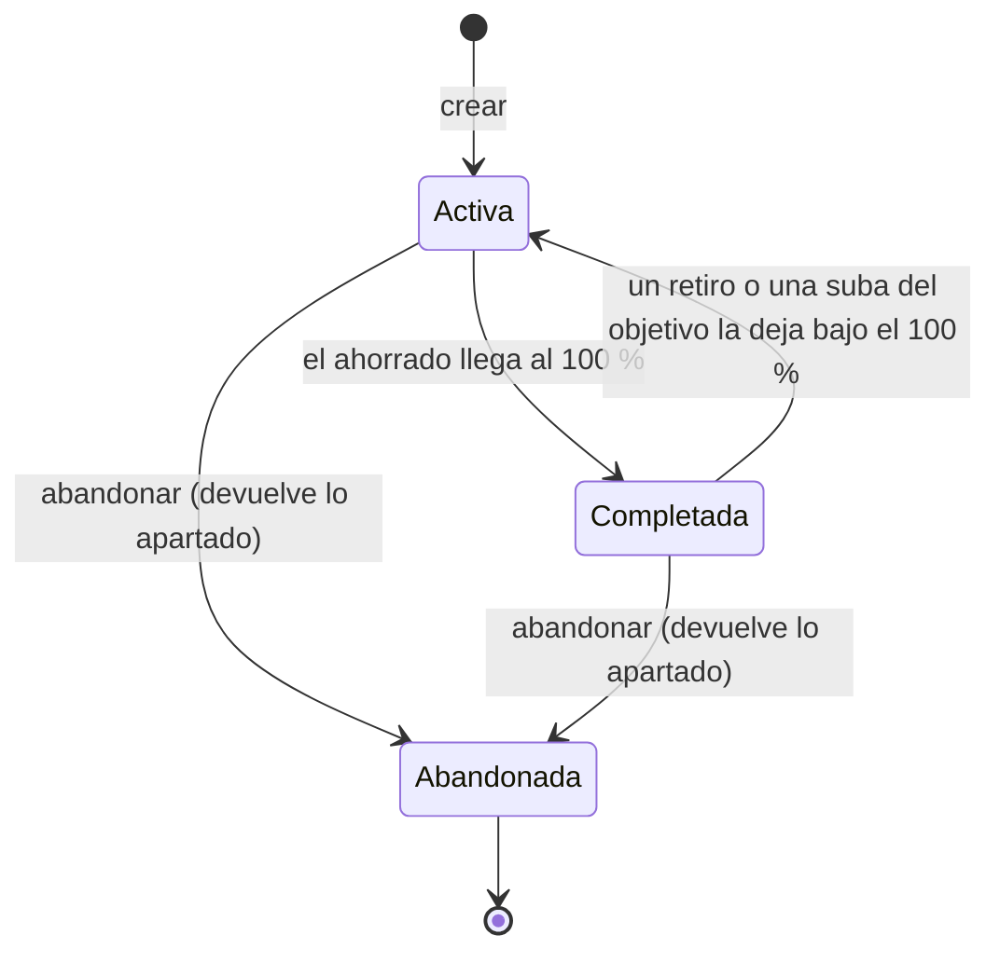

# Spec — Metas de ahorro

**Estado:** `aprobada` (2026-10-06) — supuestos y texto aprobados «sin leer».
**Fecha:** 2026-10-06
**Traza:** [`assumptions.md`](assumptions.md) · **Después de esta spec:** la reescritura del RFC 011 en `DRAFT` (el `APPROVED` actual es de un texto anterior al core contable) y los planes `metas-1` y `metas-2`.
**Referencia visual:** `/metas` de `~/Dev/finanzas/FinanzasMock`.

---

## Historia

Como **persona que lleva sus finanzas en FinanzIA**, quiero **apartar plata para un objetivo —un viaje, un fondo de emergencia— y ver
cuánto llevo ahorrado**, para **no gastar lo que ya tiene destino y saber cuánto me falta**.

## Contexto y problema

- Hoy no hay forma de decirle a la aplicación que una parte del saldo de una cuenta «es para algo». El saldo de `/accounts` es todo plata gastable.
- El RFC 011 describe esto como **reservas virtuales** sobre una cuenta, pero **su texto es anterior al core contable**: usa `integer` en vez de `bigint`, importa un
  `features/accounts/schema.db` que no existe, no tiene divisa y no distingue qué cuentas pueden reservar. Se reescribe; la **idea de fondo se conserva**.
- **Decisión de fondo de esta spec: el ahorro es virtual.** No se mueve plata ni se genera ningún asiento contable. Es una anotación **encima** del libro, no parte de él.
  Eso lo hace simple y reversible, y obliga a explicar por qué el Patrimonio Neto **no** cambia al apartar plata (RN-16).

## Alcance

**Incluye**
- Una página `/goals`, rotulada «Metas».
- Crear, editar, aportar a, retirar de y abandonar metas.
- El **saldo libre** de cada cuenta de activo con plata apartada, visible en `/accounts`.
- Indicadores por divisa, progreso, aporte mensual sugerido y el historial de aportes de cada meta.

**No incluye**
- Aportes automáticos o recurrentes, rendimientos o intereses.
- Metas compartidas entre organizaciones, metas por categoría, imagen o emoji propio.
- Mover plata real entre cuentas: apartar **no** es transferir.
- Cambiar la divisa de una meta (se abandona y se crea otra).

## Glosario

| Término | Significa |
| :--- | :--- |
| **Meta** | Un objetivo con monto, divisa y, opcionalmente, fecha |
| **Reserva** | Plata apartada **de una cuenta** para **una meta**; virtual |
| **Aporte / retiro** | Apartar o devolver plata entre una cuenta y una meta |
| **Ahorrado** | Aportes menos retiros de una meta |
| **Reservado de una cuenta** | Aportes menos retiros de **todas** las metas sobre esa cuenta |
| **Saldo libre** | Saldo de la cuenta menos lo reservado |
| **Descubierta** | Una cuenta cuyo saldo es menor a lo reservado (saldo libre negativo) |

## Actores

| Acción | `owner` | `member` | `viewer` (sólo lectura) |
| :--- | :---: | :---: | :---: |
| Ver Metas y el saldo libre | ✓ | ✓ | ✓ |
| Crear, editar, aportar, retirar, abandonar | ✓ | ✓ | ✗ (los botones no se muestran) |

## Reglas de negocio

**La meta**
- **RN-1.** Una meta tiene **nombre** (1 a 150 caracteres), **monto objetivo** mayor a cero, **divisa**, **fecha límite** opcional y **prioridad** (normal o prioritaria).
- **RN-2.** Se pueden editar el nombre, el monto objetivo, la fecha y la prioridad; **la divisa no**.
- **RN-3.** Estados: **activa**, **completada** y **abandonada** (ver el diagrama).
- **RN-4.** Las metas abandonadas **no aparecen** en ningún filtro de la lista; se conservan, con su historial.

**Aportar y retirar**
- **RN-5.** Aportar es apartar plata de una **cuenta de activo de la divisa de la meta** hacia esa meta. **No se mueve plata y no se genera ningún asiento contable.**
- **RN-6.** No se puede aportar más que el **saldo libre** de la cuenta (saldo − lo ya reservado): sin sobregiro de reserva.
- **RN-7.** Retirar es devolver plata de una meta a **una cuenta en particular**: no se puede retirar más de lo que esa meta tiene apartado **en esa cuenta**.
- **RN-8.** Se puede aportar a una meta **completada** (el excedente cuenta como ahorrado); el progreso se muestra topado en 100 %.
- **RN-9.** No se aporta a una meta **abandonada**.
- **RN-10.** Todo aporte y retiro es **atómico** y **serializado por cuenta y por meta**: dos aportes simultáneos a la misma cuenta no pueden, juntos, superar su saldo libre.

**El progreso y los estados**
- **RN-11.** Progreso = ahorrado ÷ monto objetivo. **Al alcanzar el 100 % una meta activa pasa sola a completada.** Un retiro (o una suba del monto objetivo) que la deja por debajo del 100 % **la reabre** sola.
- **RN-12.** **Abandonar** devuelve a cada cuenta lo que esa meta tenía apartado en ella (queda registrado como retiros) y deja la meta abandonada.
- **RN-13.** Si hay fecha límite y la meta está activa, se muestra el **aporte mensual sugerido**: lo que falta ÷ los meses calendario que restan hasta el mes de la fecha, **al menos 1**, redondeado hacia arriba. Con la fecha vencida no se sugiere nada y se marca «vencida»; sin fecha, tampoco.
- **RN-14.** Gastar lo ahorrado **no es una acción de Metas**: se carga el gasto como un movimiento normal y después se retira la parte apartada.

**El saldo libre**
- **RN-15.** `/accounts` muestra, en cada cuenta de activo **con plata reservada**, su **saldo libre** junto al saldo; las cuentas sin reservas no muestran nada de más. Una cuenta **descubierta** se marca como tal, y lo mismo las metas que tienen reserva en ella.
- **RN-16.** Las reservas **no cambian el Patrimonio Neto** ni ningún saldo del libro: la plata sigue siendo del usuario.
- **RN-17.** Un gasto que deja una cuenta descubierta **no se bloquea**: sólo se avisa (RN-15).

**La pantalla**
- **RN-18.** Indicadores arriba, **por divisa** y sin sumar divisas: total de metas, monto objetivo total, ahorrado total (y su porcentaje), completadas y por completar. Selector de divisa, como Estadísticas.
- **RN-19.** Filtro **Todas / Activas / Completadas**. Cada meta es una tarjeta con barra de progreso, ahorrado, objetivo, fecha, estado y su historial de aportes.
- **RN-20.** Una meta **prioritaria** se distingue visualmente y se lista primero dentro de su filtro; después, por fecha límite más próxima y luego por nombre.
- **RN-21.** El ojito de privacidad enmascara los importes; los porcentajes y estados siguen visibles. Textos en `es`, `en` y `br`.

### Diagrama de estados — una meta



### Tabla de decisión — ¿se acepta un aporte?

El orden es el de la evaluación. La tabla expone un cruce entre el estado de la meta, la divisa y el saldo libre que la historia no veía.

| # | Meta | ¿Cuenta de activo de la organización? | ¿Misma divisa? | ¿Monto ≤ saldo libre? | Resultado |
| :-: | :--- | :-: | :-: | :-: | :--- |
| 1 | abandonada | — | — | — | Rechazo (RN-9) |
| 2 | activa o completada | no | — | — | Rechazo |
| 3 | activa o completada | sí | no | — | Rechazo |
| 4 | activa o completada | sí | sí | no | Rechazo: «supera el saldo libre» (RN-6) |
| 5 | activa | sí | sí | sí | Se acepta; si llega al 100 % pasa a completada |
| 6 | **completada** | sí | sí | sí | Se acepta; el excedente cuenta (RN-8) |

**Hueco que mostró la fila 4:** una cuenta **descubierta** tiene saldo libre negativo, así que **no admite ningún aporte nuevo**, a ninguna meta, hasta que el saldo la cubra o se retire reserva. Se muestra con ese mensaje.

## Flujos

**Camino feliz**
1. Abre Metas y toca «Nueva meta»: «Viaje», $2.000.000, para el 31 de diciembre, prioritaria.
2. Toca «Aportar», elige «Mercado Pago» (saldo libre $500.000) y aparta $200.000.
3. Ve la meta al 10 % con un aporte mensual sugerido; en `/accounts`, Mercado Pago muestra su saldo y «libre $300.000».
4. Un mes después aporta de nuevo. Al llegar al 100 %, la meta pasa a «completada».

**Alternativos**

| # | Situación | Qué pasa |
| :-: | :--- | :--- |
| A1 | No hay metas | Estado vacío con una invitación a crear la primera |
| A2 | No hay cuentas de activo en la divisa de la meta | El modal de aporte lo dice y no deja continuar |
| A3 | Aportar más que el saldo libre | Se rechaza con el saldo libre a la vista |
| A4 | Retirar más de lo apartado en esa cuenta | Se rechaza con lo apartado a la vista |
| A5 | Dos aportes simultáneos a una cuenta con saldo libre para uno solo | Uno se acepta y el otro se rechaza |
| A6 | Un gasto deja la cuenta descubierta | El gasto se registra; la cuenta y sus metas se marcan |
| A7 | Subir el monto objetivo de una meta completada | Se reabre |
| A8 | La fecha límite ya pasó | «Vencida»; sin aporte sugerido |
| A9 | Abandonar una meta con plata apartada | Se devuelve a cada cuenta y queda en el historial |
| A10 | Hay metas en dos divisas | El selector las ofrece; los indicadores no se mezclan |
| A11 | `viewer` | Ve todo; no hay botones de escritura |

## Wireframes

Celular primero, una columna.

**Estado base**
```
┌──────────────────────────────┐
│ Metas                        │
│ ARS ▾              [+ Nueva] │
├──────────────────────────────┤
│ Metas 3  ·  Completadas 1    │
│ Objetivo total  $ 3.500.000  │
│ Ahorrado        $ 1.240.000  │
│ 35 % del total               │
├──────────────────────────────┤
│ [Todas][Activas][Completadas]│
├──────────────────────────────┤
│ ★ Viaje              10 %    │
│ ██░░░░░░░░░░░░░░░░           │
│ $ 200.000 de $ 2.000.000     │
│ para el 31/12 · sugerido     │
│ $ 180.000 por mes            │
│ [Aportar] [Retirar]          │
│ Último aporte 12/05 · $ 200k │
│ Fondo emergencia     62 %    │
│ ███████████░░░░░░░           │
│ $ 620.000 de $ 1.000.000     │
│ ⚠ cuenta descubierta         │
└──────────────────────────────┘
```
**Modal «Aportar»**
```
┌──────────────────────────────┐
│ Aportar a «Viaje»            │
│ Desde la cuenta              │
│ [Mercado Pago   ▾]           │
│ Saldo libre      $ 500.000   │
│ Monto           [ 200.000 ]  │
│          [Cancelar][Aportar] │
└──────────────────────────────┘
```
**En `/accounts`:** bajo el saldo de una cuenta con reservas, una línea más: `libre $ 300.000` (y «descubierta» si es negativa).
*Estados:* vacío (A1); sin cuenta compatible (A2: el modal explica y deshabilita «Aportar»); error junto al campo; esqueletos al cargar; ojito cerrado con importes `••••••`; un `viewer` sin «+ Nueva», «Aportar», «Retirar» ni «Abandonar».

## Datos

| Entidad | Campos | Notas |
| :--- | :--- | :--- |
| `goals` (nueva) | `id` · `organizationId` · `name` · `currency` · `targetAmount` (centavos) · `targetDate` (fecha, nulo) · `priority` (`normal`/`high`) · `status` (`active`/`completed`/`abandoned`) · `completedAt` · `createdAt` · `updatedAt` | `targetAmount` > 0 |
| `goal_movements` (nueva) | `id` · `organizationId` · `goalId` · `accountId` · `kind` (`contribution`/`withdrawal`) · `amount` (centavos, > 0) · `occurredAt` · `createdAt` | **Sólo se inserta, nunca se actualiza ni se borra.** Lo ahorrado y lo reservado **son sumas de este registro** |

Importes en centavos enteros (`bigint`) y todo con `organizationId`. **No se agrega nada a `accounts`**: el saldo libre se **calcula**, no se guarda.

## Criterios de aceptación

```gherkin
AC-1 — Crear una meta
  Dado un usuario autenticado
  Cuando crea «Viaje» de $2.000.000 en pesos, para el 31 de diciembre, prioritaria
  Entonces la meta aparece activa al 0 %, primera de la lista
```
```gherkin
AC-2 — Aportar baja el saldo libre
  Dado «Mercado Pago» con saldo $500.000 y sin reservas
  Cuando aporto $200.000 a «Viaje» desde esa cuenta
  Entonces «Viaje» muestra $200.000 ahorrados
    y en /accounts Mercado Pago muestra saldo $500.000 y «libre $300.000»
    y no se creó ningún asiento contable
```
```gherkin
AC-3 — No se aporta más que el saldo libre
  Dado Mercado Pago con saldo $500.000 y $300.000 ya reservados
  Cuando intento aportar $250.000
  Entonces se rechaza y veo el saldo libre de $200.000
```
```gherkin
AC-4 — Aportes simultáneos
  Dado una cuenta con saldo libre de $100.000
  Cuando dos aportes de $80.000 se envían a la vez
  Entonces uno se acepta y el otro se rechaza
    y el reservado de la cuenta es $80.000
```
```gherkin
AC-5 — La divisa tiene que coincidir
  Dado una meta en pesos y una cuenta de activo en dólares
  Cuando intento aportar desde esa cuenta
  Entonces no se ofrece, y forzarlo en el servidor es rechazado
```
```gherkin
AC-6 — Retirar
  Dado «Viaje» con $200.000 apartados de Mercado Pago
  Cuando retiro $50.000 a Mercado Pago
  Entonces «Viaje» queda en $150.000 y el libre de la cuenta sube $50.000
```
```gherkin
AC-7 — No se retira más de lo apartado en esa cuenta
  Dado «Viaje» con $200.000 de Mercado Pago y $100.000 de otra cuenta
  Cuando intento retirar $250.000 a Mercado Pago
  Entonces se rechaza y veo que lo apartado ahí es $200.000
```
```gherkin
AC-8 — Se completa sola
  Dado «Fondo» de $1.000.000 con $900.000 ahorrados
  Cuando aporto $100.000
  Entonces la meta pasa a «completada»
```
```gherkin
AC-9 — Se reabre
  Dado «Fondo» completada
  Cuando retiro $100.000, o subo el objetivo a $1.500.000
  Entonces la meta vuelve a «activa»
```
```gherkin
AC-10 — Aportar a una completada
  Dado una meta completada
  Cuando aporto $50.000 más
  Entonces se acepta, el ahorrado sube y la barra sigue en 100 %
```
```gherkin
AC-11 — Aporte mensual sugerido
  Dado una meta de $2.000.000 con $200.000 ahorrados y fecha en 10 meses calendario
  Cuando la miro
  Entonces la sugerencia es $180.000 por mes
    y con la fecha vencida no hay sugerencia y se marca «vencida»
```
```gherkin
AC-12 — Abandonar
  Dado una meta con $200.000 apartados de Mercado Pago y $100.000 de otra cuenta
  Cuando la abandono
  Entonces cada cuenta recupera su saldo libre
    y la meta deja de aparecer en todos los filtros
    y queda su historial con los retiros
```
```gherkin
AC-13 — Cuenta descubierta
  Dado Mercado Pago con saldo $500.000 y $400.000 reservados
  Cuando cargo un gasto de $300.000 desde esa cuenta
  Entonces el gasto se registra
    y la cuenta y las metas con reserva en ella se marcan «descubierta»
    y no admite aportes nuevos
```
```gherkin
AC-14 — El Patrimonio Neto no cambia
  Dado un patrimonio neto de $6.480.000 en Estadísticas
  Cuando aporto $200.000 a una meta
  Entonces el patrimonio neto sigue siendo $6.480.000
```
```gherkin
AC-15 — Indicadores por divisa
  Dado metas en pesos y en dólares
  Cuando elijo dólares
  Entonces los indicadores suman sólo las metas en dólares
```
```gherkin
AC-16 — Sólo lectura
  Dado un usuario viewer
  Cuando abre Metas y /accounts
  Entonces ve todo, incluido el saldo libre, y no hay botones de escritura
    y una escritura forzada es rechazada por el servidor
```
```gherkin
AC-17 — Privacidad e idiomas
  Dado el ojito cerrado y el idioma en inglés
  Cuando abro Metas
  Entonces ningún importe es legible, los porcentajes siguen visibles y todos los textos están en inglés
```

## Requisitos no funcionales

- **NFR-1.** Importes en centavos enteros hasta el borde de formateo.
- **NFR-2.** Toda consulta y escritura va con el `organizationId` de la sesión.
- **NFR-3.** Aportar, retirar y abandonar son **atómicos** y están serializados por meta y por cuenta (RN-10).
- **NFR-4.** El saldo libre y el progreso se **calculan** de `goal_movements`; no hay contadores guardados que puedan desfasarse.
- **NFR-5.** Celular primero; **sin movimiento ni cambio de dimensiones en `:hover`** (`.agents/AGENTS.md` §4); cada barra con su valor en texto.

## Dependencias

1. **El RFC 011 reescrito** en `APPROVED`, que firma el usuario.
2. **El saldo de las cuentas** (`accounts.balance`) ya existe; las reservas no lo modifican.
3. **El plan 4b del acceso**, si ya está: las acciones nuevas se clasifican en `actionPolicy`.
4. **`ProgressBar` de `presupuestos-2`** (`shared/ui/display/ProgressBar/`), si ya está; si no, se construye en el plan de metas y lo reusa presupuestos. **Se decide al ejecutar, sin duplicarlo.**
5. **`claveDeMes`** de Estadísticas (`shared/lib/monthKey.ts`) para los meses que faltan hasta la fecha.

## Supuestos resueltos

| Supuesto | Decisión | Por qué |
| :--- | :--- | :--- |
| Ahorro virtual o transferencia real | **Virtual**, sin asiento | Es la idea del RFC 011 y evita inventar cuentas de ahorro; el costo es explicar RN-16 |
| Gasto con cuenta descubierta | No se bloquea; se avisa | Bloquear un gasto real por una anotación virtual sería peor que el aviso |
| Registro vs. contador | Registro de movimientos, sin contadores | Los contadores se desfasan; el registro permite historial y es sólo sumas |
| Meta completada | Se completa y se reabre sola | Menos pasos para el usuario que un botón de «marcar» |
| Editar una meta | Nombre, objetivo, fecha y prioridad; la divisa no | No estaba en los supuestos; es lo mínimo para corregir un error de carga |
| Abandonadas | No aparecen en ningún filtro | La lista pedida tiene tres filtros y ninguno es «abandonadas» |

## Preguntas abiertas

- **PA-1.** Una meta abandonada no se puede ver ni reabrir desde la interfaz. Se asumió que alcanza; no se discutió.
- **PA-2.** Se permite aportar a una meta completada (RN-8). Se asumió; la alternativa es bloquearlo.
- **PA-3.** Una cuenta cuyo saldo baja por un gasto grande queda descubierta, y las reservas **no se reducen solas**: queda en manos del usuario retirar. Se asumió; no se discutió.
- **PA-4.** Los meses hasta la fecha se cuentan en la zona horaria del usuario; no se midió.

## Secciones condicionales descartadas

- **Contrato de interfaz:** no hay API ni evento públicos.
- **Mediciones pendientes:** ningún `M-n`.
